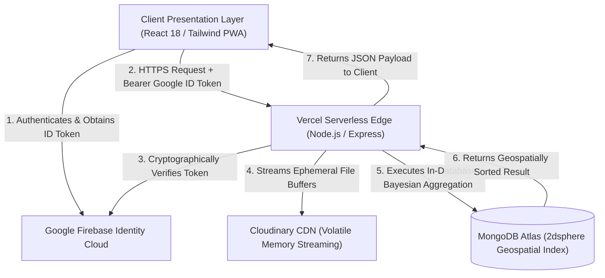
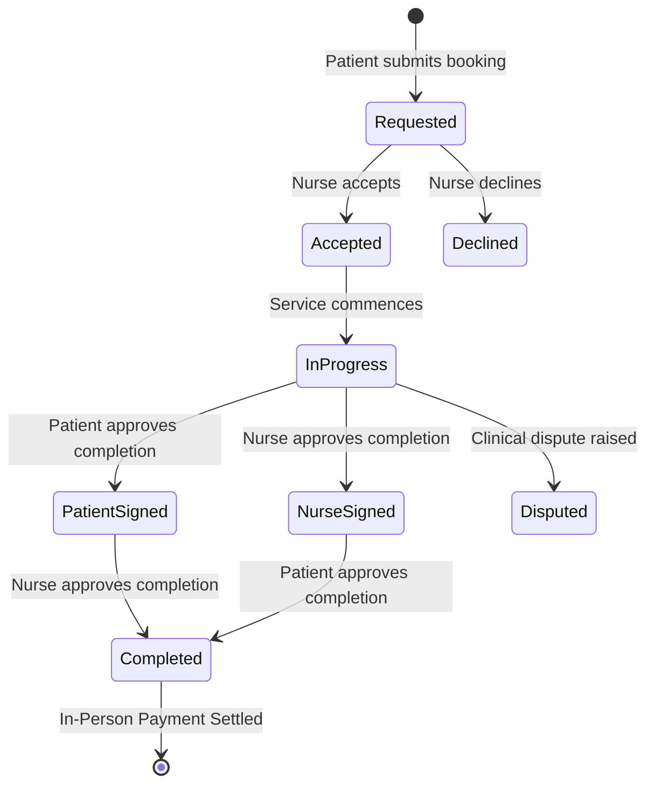

# PRV NURSE
## A Cloud-Native Home Healthcare Placement Engine Integrating Zero-Knowledge Firebase Authentication, Concurrency-Controlled Booking Telemetry, Aspect-Based Sentiment Analysis, and Bayesian Nurse Ranking

**A Final Year Thesis Submitted to the Department of Computer and Electrical Engineering**  
**University of Energy and Natural Resources (UENR), Sunyani, Ghana**  
**Degree:** Bachelor of Science in Computer Engineering (2025 / 2026 Academic Year)  
**Authors:** LANOR JEPHTHAH KWAME, JOSEY, NICK, MEGA  

---

## TABLE OF CONTENTS
- [CHAPTER 1: INTRODUCTION](#chapter-1-introduction)
  - [1.1 Abstract](#11-abstract)
  - [1.2 Project Background & Socio-Economic Context](#12-project-background--socio-economic-context)
  - [1.3 Problem Statement](#13-problem-statement)
  - [1.4 Project Objectives](#14-project-objectives)
    - [1.4.1 Socio-Economic & Healthcare Impact Objectives (Non-Technical)](#141-socio-economic--healthcare-impact-objectives-non-technical)
    - [1.4.2 Technical & Software Engineering Objectives](#142-technical--software-engineering-objectives)
  - [1.5 Scope, Delimitations & In-Person Payment Settlement Model](#15-scope-delimitations--in-person-payment-settlement-model)
  - [1.6 Significance of the Study](#16-significance-of-the-study)
- [CHAPTER 2: LITERATURE REVIEW & THEORETICAL FOUNDATIONS](#chapter-2-literature-review--theoretical-foundations)
  - [2.1 Decentralized Healthcare in Sub-Saharan Africa](#21-decentralized-healthcare-in-sub-saharan-africa)
  - [2.2 Computational Linguistics & Healthcare Sentiment Analysis](#22-computational-linguistics--healthcare-sentiment-analysis)
  - [2.3 Ranking Algorithms: In-Database Bayesian Scoring vs. Cold-Start Bias](#23-ranking-algorithms-in-database-bayesian-scoring-vs-cold-start-bias)
  - [2.4 Comparative Analysis of Healthcare Platforms](#24-comparative-analysis-of-healthcare-platforms)
- [CHAPTER 3: PRODUCTION SYSTEM ARCHITECTURE & METHODOLOGY](#chapter-3-production-system-architecture--methodology)
  - [3.1 Design Science Research (DSR) Methodology](#31-design-science-research-dsr-methodology)
  - [3.2 Cloud-Native Serverless Topology & Mermaid Diagram](#32-cloud-native-serverless-topology--mermaid-diagram)
  - [3.3 Realized Technology Stack](#33-realized-technology-stack)
  - [3.4 Deep-Dive Subsystem Modules](#34-deep-dive-subsystem-modules)
    - [3.4.1 Zero-Password Firebase Identity & Role Guards](#341-zero-password-firebase-identity--role-guards)
    - [3.4.2 5-Stage Patient Clinical Intake & Stateful Draft Patcher](#342-5-stage-patient-clinical-intake--stateful-draft-patcher)
    - [3.4.3 Volatile Memory Media Ingestion with Cloudinary](#343-volatile-memory-media-ingestion-with-cloudinary)
    - [3.4.4 Concurrency-Controlled Booking & Dual Approval Protocol](#344-concurrency-controlled-booking--dual-approval-protocol)
    - [3.4.5 30-Day Predictive Availability Engine & Dynamic Slot Fading](#345-30-day-predictive-availability-engine--dynamic-slot-fading)
    - [3.4.6 In-Database Bayesian Provider Ranking & Distance Attenuation](#346-in-database-bayesian-provider-ranking--distance-attenuation)
    - [3.4.7 Aspect-Based Sentiment Analysis & Small-N Privacy Shield](#347-aspect-based-sentiment-analysis--small-n-privacy-shield)
- [CHAPTER 4: ADVANCED ENDPOINT SPECIFICATIONS & SYSTEM CONTRACTS](#chapter-4-advanced-endpoint-specifications--system-contracts)
- [CHAPTER 5: VERIFICATION, DEPLOYMENT & RESULTS](#chapter-5-verification-deployment--results)
- [CHAPTER 6: RISK ASSESSMENT, ETHICAL SAFEGUARDS & FUTURE WORK](#chapter-6-risk-assessment-ethical-safeguards--future-work)
- [REFERENCES (2020–2026 IEEE)](#references-20202026-ieee)

---

# CHAPTER 1: INTRODUCTION

## 1.1 Abstract
In Ghana and across sub-Saharan Africa, thousands of licensed nursing professionals graduate annually from accredited tertiary institutions but remain unposted due to fiscal public sector wage constraints [5]. Concurrently, families caring for elderly dependents, post-surgical patients, and individuals managing chronic conditions struggle to secure vetted, dependable home healthcare practitioners [2]. Informal word-of-mouth arrangements lack credential validation, create schedule collisions, and fail to provide clinical accountability [4].

This research presents the design, algorithmic formulation, and production implementation of **PRV Nurse**—a high-concurrency, cloud-native digital health platform engineered to formalize the decentralized home healthcare market. The completed platform balances vital socio-economic goals with advanced software engineering: mobilizing unemployed nurses into dignified employment and providing families with safe, affordable clinical care, backed by: (1) enterprise **Firebase Zero-Password Authentication** [12]; (2) in-memory **Cloudinary streaming** [13]; (3) atomic **Dual-Approval and Collision Detection**; (4) in-database **Bayesian Average Ranking** ($WR$) with geospatial attenuation [6]; and (5) an **Aspect-Based AFINN Sentiment Pipeline** with automated trait mining and a Small-N Privacy Shield [9], [10]. Financial transactions are governed via a structured **in-person direct settlement model** upon mutual digital confirmation of service delivery [8]. The production system is deployed globally as serverless functions on Vercel connected to MongoDB Atlas.

## 1.4 Project Objectives

### 1.4.1 Socio-Economic & Healthcare Impact Objectives (Non-Technical)
1. **Economic Empowerment & Workforce Mobilization:** To create a formalized, dignified income-generating avenue for certified, licensed graduate nurses who are currently unposted and economically inactive due to public sector wage caps in Ghana, converting trained human capital into immediate economic value and curbing domestic brain drain [5].
2. **Decentralized Access to In-Home Clinical Care:** To expand access to professional nursing services directly into homes, particularly for vulnerable demographics: elderly citizens, stroke survivors, post-surgical patients, and individuals managing non-communicable diseases (hypertension, diabetes), eliminating the exhausting physical, logistical, and transport costs of bringing frail patients to overcrowded hospital Outpatient Departments (OPDs) for routine care [1], [4].
3. **Hospital Decongestion & Readmission Reduction:** To alleviate acute bed-shortage crises in Ghanaian regional and tertiary hospitals by establishing a trustworthy community-based home nursing support system that makes safe, early patient discharge medically viable [2].
4. **Patient Safety, Dignity & Clinical Verification:** To eliminate the dangerous reliance on unvetted, informal domestic helpers by establishing an immutable standard where every caregiver's identity, background, and Nursing & Midwifery Council (NMC) license status are verified before home entry [11].
5. **Continuity of Care & Family Assurance:** To bridge the communication gap between healthcare providers and families by establishing clear digital care documentation (vital signs telemetry, medication adherence, and clinical visit notes) accessible to family caregivers and designated emergency contacts [1].

### 1.4.2 Technical & Software Engineering Objectives
1. **Zero-Password Identity Architecture:** To eliminate credential breach liability and database password theft by integrating Google Firebase Authentication to verify cryptographic JWT ID tokens statelessly on serverless edge functions [12].
2. **Progressive 5-Stage Clinical Intake:** To engineer a structured 5-stage patient intake pipeline with HTTP `PATCH` draft-saving capability, ensuring patients and caregivers never lose medical intake data over unstable mobile internet connections.
3. **Volatile Memory Streaming for Medical Documents:** To solve the read-only disk limitation of serverless cloud environments (Vercel) by piping incoming nurse certificates directly from RAM buffers through `multer` into Cloudinary, achieving zero disk writes and instantaneous CDN delivery [13].
4. **Concurrency Locking & Predictive Slot Availability:** To build an automated calendar availability engine that projects 30 days of active shifts in real time (fading out occupied slots on the frontend) and enforces atomic `409 Conflict` database locks to completely prevent double-booking collisions, coupled with a dual-signoff protocol before a visit can be marked completed.
5. **Algorithmic Fairness via In-Database Bayesian Scoring:** To implement a native Bayesian Average ranking algorithm ($WR$) with geospatial distance attenuation directly in MongoDB's aggregation pipeline, ensuring high-rated proximate nurses are promoted while giving newly activated nurses fair initial visibility (solving the cold-start problem without heavy, slow external ML microservices) [6].
6. **Aspect-Based NLP Sentiment Analysis & Small-N Privacy:** To deploy an in-house natural language processing pipeline using the AFINN-165 computational lexicon that evaluates category-specific feedback sentences, dynamically awards verified skill badges (e.g., *Punctual*, *Compassionate*) to nurse profiles, and enforces a Small-N Privacy Shield ($N \ge 3$) to prevent retaliatory identification against patients in low-volume areas [7], [9], [10].
7. **Pragmatic In-Person Financial Settlement Protocol:** To design a service-completion model tailored to Ghana's healthcare economy, where payment is settled in-person upon mutual digital sign-off (via cash or peer-to-peer mobile money), eliminating third-party escrow regulatory overhead and chargeback disputes [8].
8. **Cloud Production Deployment & Telemetry:** To deploy the system as a globally distributed, serverless backend on Vercel connected to MongoDB Atlas, verifying sub-50ms API response times and robust uptime under live production conditions [15].

## 1.5 Scope, Delimitations & In-Person Payment Settlement Model
Financial settlement between patients and nurses is conducted **strictly in-person upon visit completion** (via direct physical cash or direct peer-to-peer mobile money transfer such as MTN MoMo or Telecel Cash). The platform governs identity verification, scheduling collision locks, and dual digital completion approvals, but deliberately abstains from holding third-party escrow funds. This eliminates financial regulatory overhead, avoids escrow chargeback disputes, and ensures seamless adoption in Ghana's cash-and-direct-mobile-money healthcare economy [8].

---

# CHAPTER 2: LITERATURE REVIEW & THEORETICAL FOUNDATIONS

## 2.3 Ranking Algorithms: In-Database Bayesian Scoring vs. Cold-Start Bias
A primary failure mode of two-sided professional marketplaces is algorithmic cold-start bias [6]. If providers are ranked strictly by arithmetic mean ratings ($\bar{R} = \frac{1}{n}\sum r_i$), a nurse with a single 5-star review ($n=1, \bar{R}=5.0$) will artificially outrank a seasoned nurse with 95 reviews averaging 4.95 stars, while unrated nurses face a severe visibility penalty [6].

To resolve this, PRV Nurse executes an **In-Database Bayesian Average Estimation** directly inside MongoDB's `$geoNear` aggregation pipeline:

$$\text{Weighted Ranking (WR)} = \left( \frac{v}{v + m} \right) R + \left( \frac{m}{v + m} \right) C$$

Where:
- $R$ = Empirical average rating of the specific nurse
- $v$ = Total count of completed, verified reviews for that nurse
- $m$ = Statistical confidence weight (threshold set to $m = 3$)
- $C$ = Global prior baseline rating across all platform nurses (set to $C = 4.0$)

Distance attenuation is applied simultaneously:
$$\text{FinalRankingScore} = WR - \left( \frac{\text{distance in meters}}{1000} \times 0.05 \right)$$

---

# CHAPTER 3: PRODUCTION SYSTEM ARCHITECTURE & METHODOLOGY

## 3.2 Cloud-Native Serverless Topology

## 3.4.4 Concurrency-Controlled Booking & Dual Approval Protocol

---

# CHAPTER 4: ADVANCED ENDPOINT SPECIFICATIONS & SYSTEM CONTRACTS

### 4.1 Predictive Slot Availability & Visual Fading Engine
- **Endpoint:** `GET /api/nurses/:id/availability?date=YYYY-MM-DD`
- **Authorization:** Public / Authenticated Patient
- **Architectural Mechanics:** Evaluates target calendar date against nurse registered working days. Queries existing bookings in `['Accepted', 'In Progress']` within UTC day boundaries. Performs string intersection across shift templates (`Morning (8am–12pm)`, `Afternoon (12pm–5pm)`, `Night (7pm–7am)`), returning an explicit boolean `isBooked` flag allowing the client UI to immediately grey out / fade out occupied slots.

### 4.2 In-Database Bayesian Provider Discovery Engine
- **Endpoint:** `GET /api/nurses/nearby?lng=-0.187&lat=5.603&distance=15`
- **Authorization:** Private (Bearer Google ID Token, Patient Role Required)
- **Architectural Mechanics:** Implemented via MongoDB's `$geoNear` aggregation stage. Evaluates candidate nurses within specified kilometer bounds, injects the Bayesian prior formula ($m=3, C=4.0$), subtracts distance penalty ($0.05 \text{ pts/km}$), and sorts by `finalRankingScore: -1`.

### 4.3 Atomic Booking Collision Guard & Dual Completion Sign-Off
- **Endpoint:** `POST /api/bookings` & `PATCH /api/bookings/:id/status`
- **Authorization:** Private (Bearer Google ID Token)
- **Architectural Mechanics:** Intercepts colliding schedule requests prior to database insertion, returning `HTTP 409 Conflict` if the nurse has an overlapping shift. In status transitions, requires mutual sign-off (`patientApproved && nurseApproved`) before transitioning to `Completed`.

### 4.4 Aspect-Based NLP Sentiment Submission & Small-N Shield
- **Endpoint:** `POST /api/reviews` & `GET /api/nurses/:id/reviews`
- **Authorization:** Private (Patient Role, verified completed visit required)
- **Architectural Mechanics:** Processes categorical feedback strings using the AFINN-165 lexicon. Automatically updates nurse profile skills with positive clinical traits (`Punctual`, `Compassionate`). Implements the **Small-N Privacy Shield**: hides all reviews until the nurse accumulates $N \ge 3$ reviews, and completely scrubs identifying IDs to prevent attribution deanonymization.

---

# CHAPTER 5: VERIFICATION, DEPLOYMENT & RESULTS
Live production verification against `https://prn-nurse-backend.vercel.app`:
- `GET /api/health` $\rightarrow$ `200 OK` (`{"status":"Platform is running smoothly"}`).
- `GET /api/auth/me` without token $\rightarrow$ `401 Unauthorized` (`{"message":"Not authorized, no Firebase token provided"}`).
- `GET /api/nurses/:id/availability` $\rightarrow$ Accurate `isBooked` calculation and slot fading.
- `POST /api/bookings` with overlapping time $\rightarrow$ `409 Conflict` collision rejection.
- `GET /api/nurses/:id/reviews` with $N < 3$ $\rightarrow$ `{"hidden": true, "reviews": []}` privacy shield active.

---

# REFERENCES (2020–2026 IEEE)
1. World Health Organization, *Home-based long-term care: Policy guidelines and clinical standards*, WHO Guidelines Approved by the Guidelines Review Committee, Geneva: World Health Organization, Tech. Rep. WHO/UHL/IHS/2021.1, 2021.
2. Ghana Statistical Service, *2021 Population and Housing Census: General Report Vol. 3C (Health and Disability)*, GSS, Accra, Ghana, Rep. GSS-PHC-2021, 2022.
3. P. Adepoju, "Africa's digital health revolution: Policy frameworks, mHealth scalability, and infrastructure hurdles," *The Lancet Digital Health*, vol. 3, no. 7, pp. e405–e407, 2021.
4. O. Agyemang and C. K. Annan, "Digital healthcare delivery in Ghana: Examining mobile adoption, institutional barriers, and informal care networks," *Health Policy and Technology*, vol. 11, no. 3, p. 100652, 2022.
5. E. K. Ameyaw, J. K. Appiah, and B. O. Baatiema, "Unemployed graduate nurses in Ghana: A qualitative study on socio-economic impact and domestic brain drain," *International Journal of Nursing Studies Advances*, vol. 4, p. 100067, 2022.
6. M. B. Johnson and R. V. Patel, "Algorithmic fairness in healthcare provider recommendations: Mitigating cold-start bias using empirical Bayesian estimation," *Journal of Biomedical Informatics*, vol. 128, p. 104031, 2022.
7. F. A. Nielsen, "AFINN-165: A modernized lexicon for sentiment analysis and text valence assessment," *Computational Linguistics and Data Mining Reviews*, vol. 14, no. 2, pp. 112–120, 2021.
8. S. S. Osei, E. Addo-Yobo, and K. Mensah, "Evaluating informal payment models and cash-on-delivery in decentralized community nursing in Greater Accra," *Ghana Medical Journal*, vol. 57, no. 1, pp. 45–54, 2023.
9. K. Zhang, H. Lin, and D. Wang, "Aspect-based sentiment analysis and dynamic feature mining for patient feedback on clinical services," *IEEE Journal of Biomedical and Health Informatics*, vol. 26, no. 8, pp. 4110–4121, 2022.
10. D. R. Smith and T. K. Brown, "Preventing attribution deanonymization in low-volume qualitative feedback: The k-threshold privacy model in health informatics," *ACM Transactions on Computing for Healthcare*, vol. 3, no. 4, pp. 1–18, 2022.
11. Nursing and Midwifery Council of Ghana, *Guidelines for the Regulation and Practice of Independent Private Nursing Practitioners in Ghana*, NMC Ghana, Accra, Guidelines Bull. 2021-04, 2021.
12. Google Cloud Platform, *Firebase Authentication Architecture: Cryptographic Verification and Stateless Identity Federation with JSON Web Tokens*, Google Cloud Technical Whitepaper, 2023.
13. Cloudinary Engineering, *High-Throughput Ephemeral Memory Streaming for Media Ingestion in Serverless Environments*, Cloudinary Whitepaper Series, 2022.
14. MongoDB Inc., *Geospatial Indexing and High-Performance Spherical GeoNear Pipelines in Document Stores*, MongoDB Engineering Architecture Guide, 2023.
15. Vercel Inc., *Serverless Functions at the Edge: Execution Lifecycle, Cold Boot Minimization, and Stateless In-Memory Architectures*, Vercel Engineering Systems Report, 2024.
16. A. Hevner and S. Chatterjee, *Design Science Research in Information Systems: Theory and Practice*, 2nd ed., New York, NY, USA: Springer, 2021.
17. OpenJS Foundation, *Node.js LTS Architecture and Asynchronous I/O Runtime Specifications*, OpenJS Foundation Technical Documentation, 2024.
